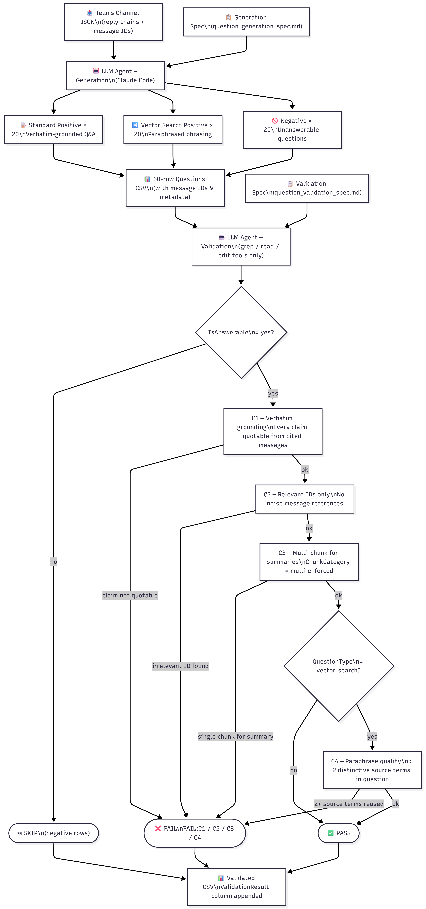

# GoldenDatasetGeneration_FHL2026
#### Automated RAG Evaluation Dataset Generation from Teams Channel Conversations

Retrieval-Augmented Generation (RAG) systems require rigorous evaluation datasets to measure retrieval accuracy, answer fidelity, and the system's ability to correctly reject out-of-scope queries. Manually authoring such datasets at scale is time-consuming and prone to inconsistency. This project presents a fully spec-driven, agent-executed pipeline for generating and validating a structured evaluation dataset directly from Microsoft Teams channel conversation exports.

The pipeline consists of two components. The generation stage instructs an LLM agent (Claude Code) to parse a Teams channel reply-chain JSON, comprehend the conversation's domain and content, and produce a 60-question CSV dataset composed of three blocks: 20 standard positive questions grounded verbatim in channel messages, 20 vector-search positive questions that express the same facts using paraphrased, synonym-rewritten phrasing to stress-test semantic retrieval, and 20 negative questions that are realistic-sounding but definitively unanswerable from the channel content. Questions are distributed across 11 topic categories, varied likelihood tiers (High / Medium / Rare), chunk scope (single-thread vs. multi-thread), and recency ranges to ensure coverage breadth. Each positive question is linked to specific parent message and reply IDs, enabling downstream traceability.

The validation stage applies four automated checks to every positive row. C1 verifies that each claim in the expected answer can be quoted verbatim from the cited messages, rejecting paraphrased or inferred content. C2 confirms that no referenced message ID is irrelevant to the question-answer pair. C3 enforces that summary and status categories reference multi-thread chunks, not single messages. C4, applied only to vector-search rows, verifies that the question does not reuse two or more distinctive domain-specific source terms verbatim — ensuring the paraphrase quality needed to test semantic retrieval rather than keyword lookup. Results are written back to the same CSV as a ValidationResult column with structured failure codes.

The entire pipeline runs without Python scripts or external orchestration; the agent uses only grep, read, and edit tools, making it portable and auditable. The resulting dataset enables measurement of RAG precision (via negative questions and threshold gating), recall (via standard positive questions), and semantic retrieval depth (via vector-search questions), providing a reproducible, content-grounded benchmark from real enterprise communication data.

🔗 **More Details:** [https://username.github.io/myrepo/index.html](https://github.com/sakusuma_microsoft/GoldenDatasetGeneration_FHL2026/blob/main/pipeline_overview.html)

## Preview

